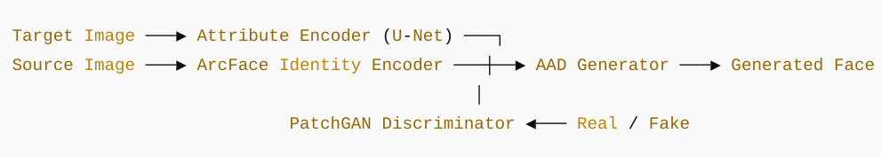

# FaceSwap GAN

This project implements a face-swapping model using PyTorch. It leverages an identity encoder (ArcFace), an attribute encoder (U-Net-based), and a generator with Adaptive Attention Denormalization (AAD) blocks to produce high-fidelity swapped face images.

Training is currently occuring on WANDB at https://wandb.ai/shaunwerkhoven-i/faceswap_GAN

<!--
<p align="center">
  
</p>
-->

## 🚀 Features

- U-Net-based attribute encoder with optional skip connections
- Pretrained ArcFace identity encoder
- AAD-based generator
- PatchGAN discriminator
- Supports LFW dataset preprocessing with face alignment
- Modular training pipeline with Weights & Biases integration
- Identity & reconstruction losses to preserve realism

## 📦 Setup

1. **Clone the repository**
   ```bash
   git clone https://github.com/your-username/faceswap-gan.git
   cd faceswap-gan

2. **Install dependencies**
   ```bash
   pip install -r requirements.txt

3. **Download required models**
- Download ArcFace weights [here](https://github.com/sberbank-ai/sber-swap/releases/download/arcface/backbone.pth), place in `arcface_model/`
- InsightFace ONNX face detectors (https://github.com/sberbank-ai/sber-swap/releases/download/antelope/glintr100.onnx) and (https://github.com/sberbank-ai/sber-swap/releases/download/antelope/scrfd_10g_bnkps.onnx), place in `insightface_func/models/antelope/`

4. **Prepare LFW dataset**
- Download LFW Funneled Images
- Extract to: archive/lfw-funneled/lfw_funneled

5. **Run training**
   ```bash
   python train.py

## 🧠 Model Architecture
<p align="center">
  
</p>

## ✅ To-Do

 - Improve visual quality with perceptual loss
 - Add validation metrics
 - Support Docker for easy setup
